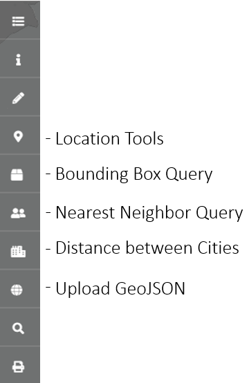

# Assignment 5 - Finding the shortest path between A and B using Spatial Data Structures and Constructs

## Corbin Matamoros

## Description

This project adds one element of functionality to A04, and that's pathing from any city in the US to another using the North American roads dataset. Not all paths are possible, however, but for the ones that are, the distance of the trip is in miles and can be affected by the roads the path takes. The score of the path is the number of events (earthquakes, volcanos, and ufo sightings) that occured within 0.2 degrees of the path. **For additional support, see our class's [group project wiki](https://github.com/Ladelle/SpatialDataClassProj/wiki).** Props to Ladelle for setting that up.

This project utilizes and builds on [Portmap](https://github.com/portofportlandgis/portmap) (documentation below) to perform queries on geospatial data such as nearest neighbor queries, bounding box operations, spatial data visualization, and more (see functionality section -- WIP -- below for details). The backend is programmed in Python and run using [Flask](https://flask.palletsprojects.com/en/1.1.x/). The frontend is HTML with JQuery and Javascript.

## Files

|   #   | Folder Link | Assignment Description |
| :---: | ----------- | ---------------------- |
|   1    | [main_flask_app.py](assets/api/main_flask_app.py) | App backend that runs locally and processes requests (clicks and URLs) from the frontend |
|   2    | [index.html](index.html) | Interactive HTML map of the world. |
|   3    | [map.js](assets/js/map.js) | The javascript/JQuery code that works with `index.html`. |
|   4    | [testScripts](assets/api/testScripts/) | A set of project functionality prototypes. I wrote these to test features before adding them |
|   7    | [data.7z](assets/api/data/data.7z) | Compressed copy of all datasets. Unzip into the [data](assets/api/data/) folder before running the project |
|   8    | [A05.yml](A05.yml) | An export of the conda environment with which this project was developed |
|   9    | [README_images](README_images) | Image(s) used in the README.md file |

## Instructions

1. Download the repo and (optional, but __VERY__ recommended) create a conda environment with [Miniconda](https://docs.conda.io/en/latest/miniconda.html) or [Anaconda](https://conda.io/projects/conda/en/latest/user-guide/install/index.html). Create a new environment in the anaconda console using either [A04.yml](A04.yml) with [this method](https://docs.conda.io/projects/conda/en/latest/user-guide/tasks/manage-environments.html#creating-an-environment-from-an-environment-yml-file) or following these instructions:

```txt
(base) ~/> conda create -n <environment name>
(base) ~/> conda activate <environment name>
(base) ~/> conda config --env --add channels conda-forge
(base) ~/> conda config --env --set channel_priority strict
```

1. The packages necessary to run this software are [Python](https://www.python.org/), [flask](https://flask.palletsprojects.com/en/1.1.x/), [flask-cors](https://flask-cors.readthedocs.io/en/latest/#installation), [geopandas 0.8.1](https://geopandas.org/install.html#creating-a-new-environment), [scipy](https://www.scipy.org/install.html#installation),[numpy](https://numpy.org/install/), [geopy](https://geopy.readthedocs.io/en/stable/), and [Networkx](https://networkx.org/documentation/stable/). I recommend using conda to install all of these. (If using the channel 'conda-forge' in a conda environment as suggested in instruction 1, numpy will be installed when you install geopandas.)

2. Paste your Mapbox token on line 1 of [map.js](assets/js/map.js).

3. Unzip [data.7z](assets/api/data/data.zip) into [data](assets/api/data/)

4. Run the flask app by executing it in the conda environment. Execute from the root of the repo. The command would look something like this: `~/miniconda3/env/<environment name>/python.exe ./Assignments/A04/assets/api/geotest.py False`

5. Launch the `index.html` on a server, such as [Live Server](https://marketplace.visualstudio.com/items?itemName=ritwickdey.LiveServer)

6. Hopefully everything is running. Click the buttons on the left side to access the functionality. If, however, you get an error like [this one](https://github.com/numpy/numpy/issues/14770), try following the [suggestion here](https://github.com/numpy/numpy/issues/14770#issuecomment-602181479) and see if that fixes it. Installing Networkx through conda has failed for some, so install in the order indicated by `A05.yml`. If that doesn't work, you might need to switch to a Linux environment (if on Windows).

## Functionality

### Available Tools



### Layers (NEW!!!)

- Added a folder to adjust layers created by the added functionality from this project and A04.
- Click and drag to rearrange layers.
- Click the folder to close the folder. Click to open and display contents again.
- You can also click and drag folders to rearrange them

#### Location Tools

- Enter a latitude (value between -90 and 90) and longitude (value between -180 and 180), click 'find', and a red circle will appear at that location. Repeat this as many times as you'd like. Press 'clear' to remove all points from the map.
- Click 'save' to save all points visible on the map to [`assets/api/data/savedJSON.geojson`](assets/api/data/savedJSON.geojson). Click 'load' to load all points from `savedJSON.geojson` onto the map. Click 'delete' to wipe the system memory of all points visible on the map.
- Note: whenever a point is added to the map, either through loading from a `.geojson` file or manually by hitting 'find', that point is saved in memory as a `.geojson` feature. That feature is what 'delete' wipes. 'delete' does not remove points from the map or erase the `.geojson` file we can load from or save to.

#### Bounding Box Query

- Select a dataset to query by checking or unchecking its box
- To create a bounding box, click on the map where you want its top left or bottom right corner to be. Then click 'submit top left' or 'submit bottom right' to populate the bounding box inputs at the bottom. You can also input these parameters manually. For example, if you want to set (lon=-98, lat=35) as the top left position, type `-98, 35` into the 'Top Left' field. The coord order must be (lon, lat).
- Perform the bounding box query on the dataset(s) by clicking 'query'. The bounding box and all contained points will be displayed.
- Click 'convex hull' to produce the smallest convex polygon that contains all the points in the bounding box.
- Click 'clear' to remove all bounding boxes and points from the map.
- Note: There is no differentiation between points of each dataset.

#### Nearest Neighbor Query

- Select a dataset to query by checking or unchecking its box
- Select a nearest neighbor strategy, either querying for the nearest `N` neighbors or finding all neighbors within a distance `Deg` of the center. Input your values for `N` (integer from 1 to dataset_size) or `Deg` (float from 0.0 to 180.0).
- Enter the coordinates of the point from which the query will take place. Click 'query' to display results on the map. Click 'clear' to remove them from the map

#### Distance between Cities

- Type into the starting city and destination city input elements a USA city (either type a couple characters and then select from the dropdown, OR type the entire name of the city). Note: if only one city suggestion is being made, then you can't click to populate the field anymore. You must type the entire city name.
- Hit 'submit' to create a linear line drawn between the two cities. The distance between the two is shown at the bottom in miles. Click 'clear' to remove the lines and city markers.
- Hit 'directions' to find a path from the starting city to the destination city. This may take a while, so be patient. Once finished, the path will be displayed along with the distance of the path in miles (on the sidebar), the events (ufo sightings, volcanos, and earthquakes) that occured within a 0.2 degree radius of the path, and your score (on the sidebar). Your score is just the event count
- NOTE: If you want to see the 0.2 degree buffer, go to [`buffered.geojson`](assets/api/data/shortest_paths/buffered.geojson) and copy-paste the Feature Collection into the Upload GeoJSON modal (explained below)

#### Upload GeoJSON

- Paste a valid geoJSON feature or feature collection in the text area and click 'submit' to view it on the map. If pasting a single feature, you don't need to include it in a feature collection. Pasting as is will suffice. If you want to display multiple features, though, you must use a feature collection.

## Undesired behavior

- There is no distinction between points from different datasets in Nearest Neighbor Query or Bounding Box Query. Also, no difference is made between the three types of events (earthquakes, ufo sightings, and volcanos) when finding all events within 0.2 degrees of a path between two cities in the 'Distance between Cities' modal.
- If the webpage refreshes when you hit the save button in 'Location Tools' or when finding a path between two cities, either find out how to use `event.stopPropagation` or `event.preventDefault` methods in javascript (they'll go in [map.js](assets/js/map.js) somewhere) or put this line in your vscode `settings.json` if you're using LiveServer: `"liveServer.settings.ignoreFiles": ["**"]`. If you do the latter, you will have to restart your server if you want to see any changes you make, as saving your files won't refresh the server anymore.

#

# Original PortMap Documentation

A responsive web map application template using [Bootstrap](https://getbootstrap.com/) and [Mapbox GL](https://www.mapbox.com/mapbox-gl-js/api/)

To get started you need to generate a Mapbox ID. Get your ID by creating a Mapbox account. Insert your Mapbox ID in assets/js/map.js on line 1.

## What it does

- Layer tree allows the user to interactively organize and reposition map layers using [Mapbox-GL-JS-Layer-Tree](https://github.com/TheGartrellGroup/Mapbox-GL-JS-Layer-Tree)
- Layer Tree pulls feature symbology automatically via [Font Awesome](http://fontawesome.io/ )
- Supports drawing and editing using [Mapbox Draw API](https://github.com/mapbox/mapbox-gl-draw)
- User can calculate area and length of drawn features using [Mapbox Turf](https://www.mapbox.com/help/define-turf/)
- User can add labels directly to the map as a symbol layer using [Mapbox-GL-JS-Text-Markup](https://github.com/TheGartrellGroup/Mapbox-GL-JS-Text-Markup)
- User can easily find latitude and longitude by clicking on the map
- Global address search using the [mapbox-gl-geocoder](https://github.com/mapbox/mapbox-gl-geocoder)
- Search JSON Properties with autocomplete and zoom to feature
- Client side Print Export to PNG or PDF with legend: [Print/Export for Mapbox GL](https://github.com/TheGartrellGroup/Mapbox-GL-Print-Export-For-Port)
- Identify multiple features and view attributes in a modal
- Bookmark drop-down list
- Disclaimer modal
- Scale bar
- Not included in this repo: Save Views function allows the user to save Layer Tree configuration, Mapbox drawn features, Text Markups, and Zoom and Pitch. All plugins in this repo have code pre-built to work with the Save Views plugin: [Mapbox-GL-JS-save-view](https://github.com/TheGartrellGroup/Mapbox-GL-JS-save-view)

## Demo

[Demo](https://cdettlaff.github.io./)

## Quick Preview

### Layer Tree


### Identify


### Draw and Text


### Search JSON with autocomplete


### Client Side Printing


### Mobile View


